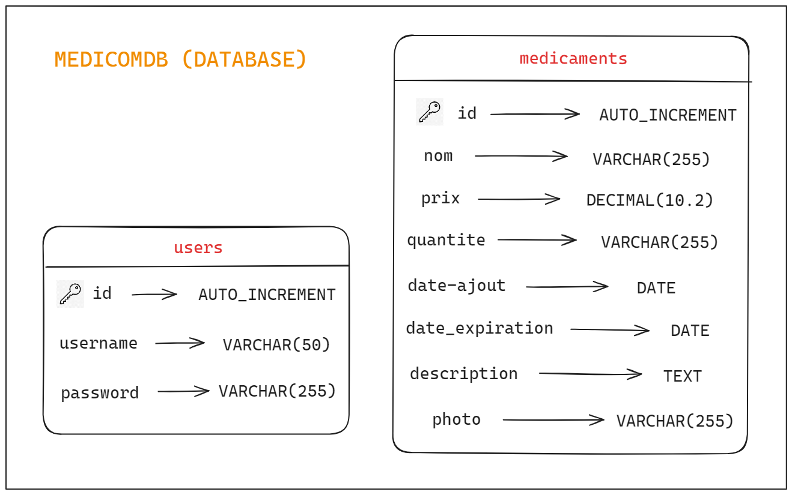

# INFORMATION PROF ACCÈS APPLICATION :
IP Publique : [84.235.232.142](http://84.235.232.142/)

Accès pour la connexion au site : 
- Username : *root*
- Password : *root*


<br> 

# SOMMAIRE

- INTRODUCTION        
    - Prérequis en LOCAL
    - Installation des logiciels en LOCAL

- LA BASE DE DONNÉES
    - Présentation détaillée des tables

- DÉPLOIEMENT DE L'APPLICATION SUR UNE MACHINE VIRTUELLE + ACCÈS SSH DEPUIS L'EXTÉRIEUR
    - Création de la VM et accès via SSH 
    - Configuration de la VM
    - Installation des logiciels et des modules nécessaires
    - Fichiers de configuration à modifier sur la VM

- Utilisation de Git pour synchroniser les fichiers de l'application
    - Pour travailler sur son dépot Git

- CONCLUSION

<br> 

# INTRODUCTION 

L'entreprise MEDICOM est une industrie pharmaceutique fictive créée pour ce projet qui a pour but de créer un site qui servira à la gestion des stocks des médicaments dans l'entrprise enregistrés dans une table dans la base de données avec une possibilité de connexion avec des logins et des mots de passe enregistrés eux aussi dans la base de données.  

## Prérequis

### XAMPP 

XAMPP est un ensemble de logiciel qui va permettre facilement de déployer et de nous fournir un environnement de développement Apache et une base de données MySQL. 

Pour l'installation de XAMPP, il faut se diriger sur [ce lien](https://www.apachefriends.org/fr/download.html).

Suivez les instructions qui vous sont montrés durant l'installation et cliquer sur "Suivant" en laissant les choix par défaut.

## Installation des logiciels

Pour la mise en place et à l'accès de la base de donnée, nous devons ouvrir ***le panneau de contrôle de XAMPP*** et sélectionner les boutons "Start" pour **Apache** et **MySQL**. 
<br> 


<br>

# LA BASE DE DONNÉES

Derrière ce site web repose une base de donnée ordonnée et simple d'utilisation permettant une utlisation efficace au sein du code. La base de données contient 2 tables disticntes :




> **users**

La table "users" permet de stocker les informations de connexion des utilisateurs. Elle contient tous les noms d'utilisateurs et les mots de passe de connexion. Cette table est uniquement utilisée pour 2 cas principalement :
<br>

- Elle permet notamment durant le remplissage du formulaire lors d'une **"Connexion"** d'aller chercher les informations de connexion sur cette table et vérifier si le nom d'utilisateur existe et que le mot de passe rentré est bien attribué à ce nom d'utilisateur.

- Elle permet également lors du remplissage du formulaire d'**Inscription** d'envoyer les données dans cette table et ainsi enregistrer ces nouvelles informations dans la base de données pour une évetuelle connexion plus tard. 
<br> <br>

 > **médicaments**

 La table "médicaments" permet de stocker toutes les informations concernant les médicaments enregistrés dans la base de données. Elle contient les informations conçernant : les noms, le prix, la quantité, la date d'ajout ainsi que la date de modification de tous les produits.

 Cette table est notamment utilisée pour deux cas principalement : 

 - **Pour la gestion des produits** pour pouvoir gérer directement via le site les informations concernant le stock pour chaque médicaments. 

 - **Pour la présentation des médicaments sur le dashboard** pour permettre d'afficher tous les médicaments présents dans la base de données ainsi que toutes les informations correspondantes à chaque produits.
 <br> <br>

# DÉPLOIEMENT DE L'APPLICATION SUR UNE MACHINE VIRTUELLE + ACCÈS SSH DEPUIS L'EXTÉRIEUR

### Étape 1 : Création de la VM et accès via SSH 
--- 

Pour pouvoir déployer l'application, il faut créer une Virtual Machine (VM) en se connectant à un compte Oracle sur Oracle Cloud grâce à [ce lien](https://www.oracle.com/cloud/free/).

Après s'être connecté sur Oracle Cloud, il faut pour cela se connecter sur le tableau de bord et **créer une nouvelle Instance**.

Dans la configuration de l'instance, il faut pour cela choisir une image de base LINUX (Dans notre cas, nous avons choisi en "Always Free" l'image Canonical Ubuntu v22.04)

**IMPORTANT :** Pendant la configuration de l'Instance, un avertissement vous conseillera fortement de créer l'intsance sans un accès SSH comprenant une clé publique et une clé privée.

Après avoir finalisé l'installation de l'instance, vous devez arriver sur cette page, voici un exemple :


Après avoir associé la clé publique avec l'instance, pour pouvoir avoir accès à la VM, vous pouvez utiliser le logiciel PuTTY qui consiste à pouvoir avoir accès en SSH via une paire de clé à n'importe quelle machine Pour le téléchargement, cliquez sur [ce lien](https://www.putty.org/).

Pour l'utilisation de PuTTY, vous devez entrer 'myuser'@'IP PUBLIQUE' avec le port 22 et bien rajouter dans **Connection/SSH/Auth/Credentials** et rajouter dans "Private key file for authentification" votre **clé privée** associée à la clé publique.


### Étape 2 : Configuration de la VM :
---

Après avoir réussi à créer l'instance sur Oracle Cloud, attribuer une paire de clé pour un accès SSH à la machine, nous allons donc installer tout ce dont on a besoin pour le déploiement :

#### Installation de Apache2, PHP, MySQL Server et les modules nécessaires :
---
Commandes de base pour mettre à jour la VM :

```bash
sudo apt update
sudo apt upgrade -y
```

Installation et activation de Apache2 :

```bash
sudo apt install apache2 -y
sudo systemctl start apache2 sudo systemctl enable apache2
```
Installation de PHP :

```bash
sudo apt install php libapache2-mod-php php-mysql -y
```

Installation et sécurisation de MySQL Server :

```bash
sudo apt install mysql-server -y
sudo mysql_secure_installation 
```

Cette dernière commande permet de sécuriser **l'installation et les accès de MySQL** directement sur le serveur Ubuntu où l'application est déployée. Elle permet de parametrer l'application en fonction de certains droits / accès pour la base de données. Elle est un bon moyen de **conteneuriser les infos sensibles** dans l'environnement où l'application est déployée.

Après avoir installé MySQL, nous devons désormais ajouter un utilisateur "admin" qui va permettre une connexion avec tous les droits tout en empêchant la connexion avec "root".

Connexion à MySQL avec le compte root :
```bash
sudo mysql -u root -p
```

Création de la Base de Données : 
```sql
CREATE DATABASE nom_de_votre_base_de_donnees;
```
Création d'un utilisateur admin :

```sql
CREATE USER 'admin'@'localhost' IDENTIFIED BY 'mot_de_passe';
```

Affectation des droits au compte admin :
```sql
GRANT ALL PRIVILEGES ON nom_de_votre_base_de_donnees.* TO 'admin'@'localhost';

FLUSH PRIVILEGES;
EXIT;
```

#### Fichiers de configuration à modifier sur la VM :
---
Que ce soit en local sur votre ordinateur comme sur la  VM, vous devez renseignez et modifier des informations sur certains fichiers de configuration :

- Dans **/etc/apache2/conf-available/**, créer un fichier **env-vars.conf**.

- L'équivalent en local sur XAMPP est dans **C:/xampp/apache/conf/httpd.conf**.

Dans ces fichiers-là, veuilez renseigner les ***variables d'environnement Apache*** entrées dans votre code avec la fonction **"getenv"**: 


Suite à cela, vous devez aller chercher ces variables d'environnement et les assigner avec la commande **"SetEnv"** dans les deux fichers de configurations cités au-dessus :


<br>

Modification du fichier de configuration de l'application avec la commande suivante :
```bash
sudo nano /etc/apache2/sites-available/votre_site.conf
```
Puis, y rentrer ces informations :
```apache 
<VirtualHost *:80> 
    ServerAdmin webmaster@localhost 
    DocumentRoot /var/www/html/votre_application

   <Directory /var/www/html/votre_application>
       Options Indexes FollowSymLinks
       AllowOverride All
       Require all granted
   </Directory>

   ErrorLog ${APACHE_LOG_DIR}/error.log
   CustomLog ${APACHE_LOG_DIR}/access.log combined
</VirtualHost> 
```

Activation du site et redémarrage de Apache2 :

```bash
sudo a2ensite votre_site.conf
sudo systemctl restart apache2
```

Accès depuis l'IP publique à votre application (IP publique trouvée depuis l'instance créée sur Oracle Cloud) 


# Utilisation de Git pour synchroniser les fichiers de l'application :

Tout d'abord, l'installation de Git avec la commande :
```bash
sudo apt install git
```

Pour initialiser un dépot, càd choisir un répertoire qui pourra aller récupérer les fichiers depuis Git :
```bash
git init
```

Vous pouvez à tout moment vérifier l'état d'un dépot en se plaçant dans ce dernier avec la commande :
```bash
git status
```

Pour configurer un remote :
```bash
git remote add origin <url>
```

Il existe 2 "états" pour un fichier sur Git et il existe 3 "catégories" sur git où peut se situer un fichier, on peut le savoir avec la commande :

```bash
git status
```
<br>


Les 2 états de fichier sont :
- **non suivi (Untracked) :** le fichier n'est pas encore suivi par Git.
- **suivi (Tracked) :** le fichier est suivi par Git (pour qu'un fichier soit suivi par Git, on utilsera la commande "Git add <nom_du_fichier>").

Pour les fichiers suivis, il existe 3 catégories de fichiers qui sont :
- **Pas modifié (Unmodified) :** La catégorie où le fichier se trouvera immédiatement après la premier "commit" sur un fichié dejà suivi par Git.
- **Modifié (Modified) :** Dès lors qu'une modification est réalisée sur un fichié dit "Unmodified", il sera dans la catégorie "modifié" des fichiers suivis par Git.
- **(Staged) :** La catégorie "temporaire" où se situera un fichier après le moment où le fichier est ajoutée avec la commande (Git add <nom_du_fichier>)


## Pour travailler sur son dépot Git :

Prenons l'exemple pour cette VM, pour faire un lien direct entre un répertoire présent dans la VM et le Github où se situe l'application à déployer pour la première fois, on utilise la commande :

```bash
git clone <lien accès github> 
git clone https://github.com/Lucaschrrt/MEDICOM.git
```

Après avoir "cloner" le répertoire dans lesquels se trouvent désormais tous les fichiers que constituent votre application, vous pouver finalement utilisez la commande en se plaçant à l'endroit où vous avez cloné et taper cette commande :

```bash
git pull
```
Ensuite, si des modifications ont eu lieu sur Git, vous ne pourrez plus "push" vos modifications de fichier si vous n'avez pas la version exacte du remote. 
Si vous n'avez pas la même version retaper la commande **"git pull"**.

<br>

Après avoir récupérer la version du remote, et que vous avez faits des modifications sur un fichier, ajoutez-les dans l'index avec la commande :

```bash
git add <fichier>
```

Après avoir rajouté tous les fichiers modifiés, pour les enregistrer dans l'historique utilisez la commande :

```bash
git commit -m "Message de commit (first commit par exemple)"
```

Après avoir "commit" tous les fichiers souhaités, vous pouvez finalement les envoyés sur le remote avec la commande :

```bash
git push -u origin main (pour la première fois sinon)

git push
```

<br>

Enfin, après avoir cloné et "tiré" les informations depuis Git avec les commandes **"git clone"** et **"git pull"**, si la base de données SQL est également présente. Vous pouvez importer la base de données directement sur MySQL de la VM pour pouvoir exploiter les informations à l'intérieur avec la commande suivante :

```bash
sudo mysql <nom_de_la_DB_déjà_créée> < <nom_du_fichier_DB.sql>
```

Pour prendre l'exemple du site de MEDICOM, nous avons utilisé la commande suivante :

```bash
sudo mysql medicom < medicomdb.sql
```

<br>

# CONCLUSION

La mise en place de ce site web a été conçue pour la gestion de stock et de commandes pour l'organisation fictive MEDICOM et est une des nombreuses façons d'optimiser la gestion de stock pour l'entrprise à travers ce site pour y informer les utilisateurs connectés.

La conception de la base de donnée derrière a été pensé pour une gestion simple et fiable, permettant une maintenance facile et solide pour une évolution majeure de l'entreprise.